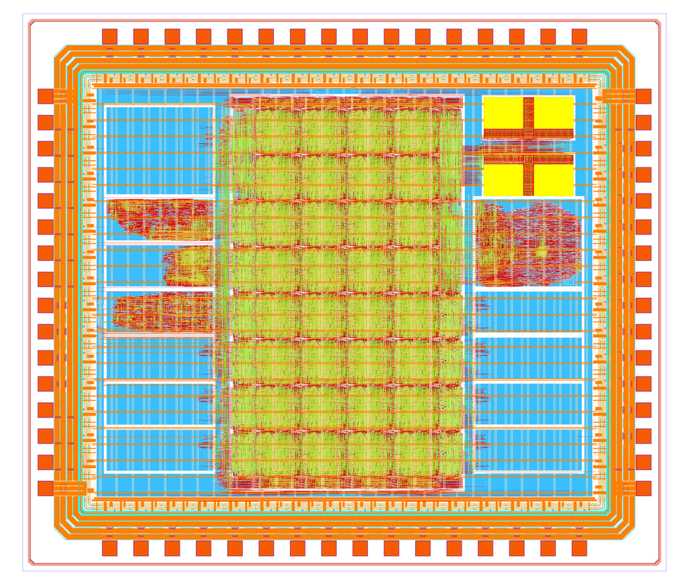

# HeiChips 2025 Tapeout


This repository contains the chip for the HeiChips Summer School 2025. It includes several designs created during the Hackathon all connected to a common eFPGA fabric in the center.
Thanks to FABulous, the user bitstream for the FPGA can be generated using the upstream yosys and nextpnr toolchain.

The chip is designed with open source EDA tools and the [IHP Open Source PDK](https://github.com/IHP-GmbH/IHP-Open-PDK).

> [!WARNING]  
> This repository is a Work in Progress.

<p align="center">
  <a href="img/heichips25_top.png">
    
  </a>
</p>

## Feature Overview

The chip includes several user submitted designs from the HeiChips 2025 Hackathon. In the center of the chip is an eFPGA which allows the user projects to connect to each other, utilize the SRAM or connect to the external I/Os.

- [FABulous](https://github.com/FPGA-Research/FABulous) eFPGA
  - 32x I/Os
  - 256x LUT4 + FF
    - w. carry chain
  - 1x SRAM
    - 32 bit-wide, 4 KiB deep
    - individual bit-enable
  - 1x global clock network

The following user projects are included:

| Group | Size | Location | Description |
|---------------|---------------|---------------|---------------|
|               |               |               |               |
|               |               |               |               |
|               |               |               |               |

TODO describe configuration modes

## Building User Designs for the eFPGA

To build a bitstream of a user design for the eFPGA, see [README.md](ip/fabric/user_designs/README.md) under `ip/fabric/user_design`.

## Running Chip-Top Level Simulation

TODO

The chip-top level testbench is written using cocotb and located under `tb/heichips25_top/`.

Enable a Nix shell with Icarus Verilog (`iverilog-12.0` at the time of writing):

```
nix shell nixpkgs#iverilog
```

Next, run the testbench:

```
python3 heichips25_top_tb.py
```

You can select a different test case in the Pyhon testbench.

## Building the Chip

> [!NOTE]
> The build process currently relies on specific branches of [LibreLane](https://github.com/librelane/librelane/tree/leo/padring) and the [IHP Open PDK](https://github.com/mole99/IHP-Open-PDK/tree/leo/padring).

TODO

To build the chip with LibreLane:

```console
librelane --manual-pdk config.yaml
```

> [!NOTE]
> You need to export `PDK_ROOT` and `PDK` to the path of the IHP Open PDK and the name of the PDK.

The final steps:

```
make copy-final
make extract
make edit-netlists
make lvs
make insert-logo
make create-image
make fill
make drc
make zip
```

And with this the chip is ready for tapeout. 

## License

The chip is licensed under the Apache 2.0 license. This license may *not* apply to the remainder of the repository.

## Acknowledgements

The chip was designed by Leo Moser for the HeiChips Summer School 2025.